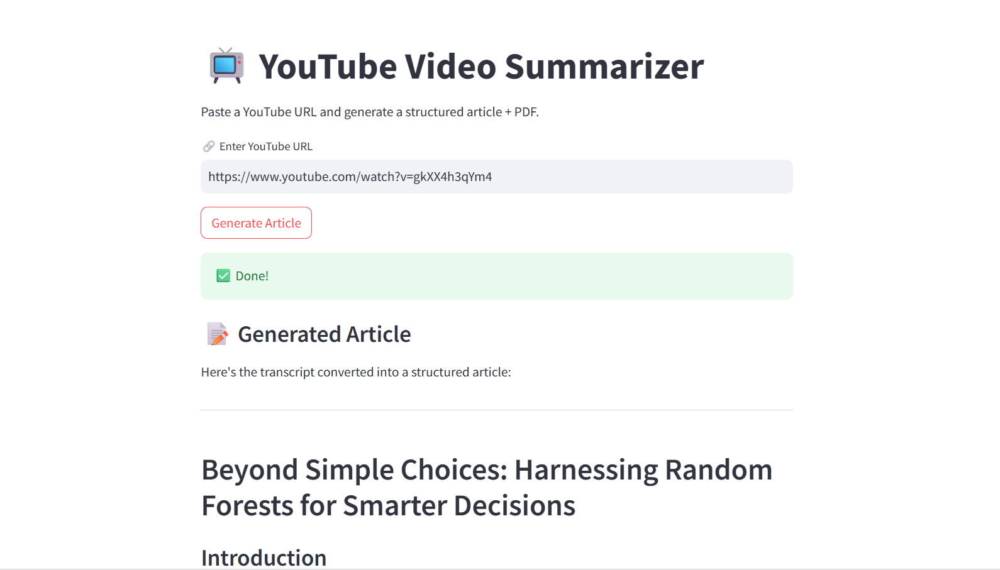
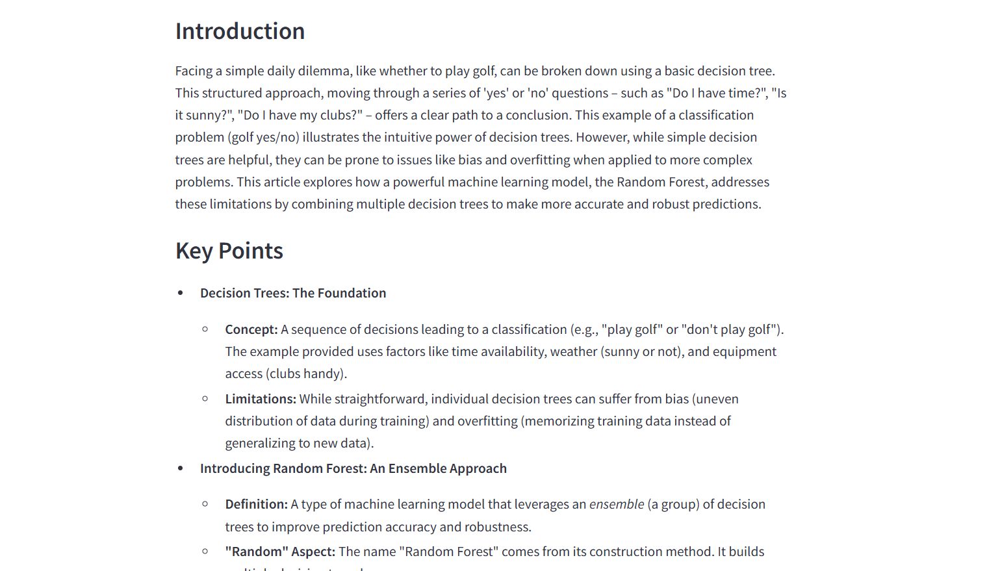
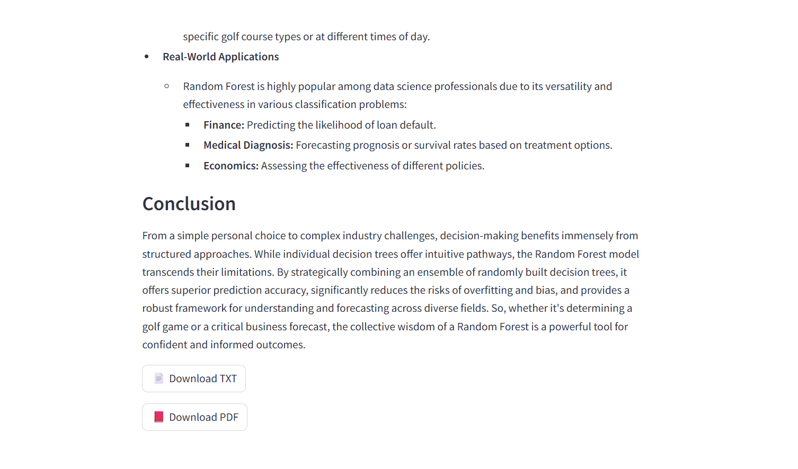

# 📺 YouTube Video Summarizer

> **> Convert YouTube videos into polished AI-generated articles and downloadable PDFs in seconds.**  
> Powered by Google Gemini 2.5 Flash · Built with Streamlit · Export to PDF & TXT

Paste a YouTube URL → Get a polished article with **Title, Introduction, Key Points & Conclusion** — ready to download in seconds.

---

## ✨ Features

| Feature | Description |
|--------|-------------|
| 🎯 **Auto Transcript Extraction** | Fetches raw transcript from any YouTube video using `youtube-transcript-api` |
| 🧹 **Smart Text Cleaning** | Cleans and normalizes transcript before AI processing |
| 🤖 **AI Article Generation** | Converts transcript to a structured article via Google Gemini 2.5 Flash |
| 📄 **PDF Export** | Generates a downloadable PDF with Unicode font support (DejaVu Sans) |
| 📝 **TXT Export** | Plain text download for easy reuse |
| 🔁 **Retry Logic** | Automatically retries on Gemini API errors (up to 3 attempts) |
| 🖥️ **Clean Web UI** | Intuitive Streamlit interface with real-time status spinners |

---

## 🖼️ Demo Preview

### 🔹 Main Interface



---

### 🔹 AI Generated Article



---

### 🔹 Export Options



---

## 🛠️ Tech Stack

```
Frontend  →  Streamlit
AI Engine →  Google Gemini 2.5 Flash (google-genai)
Transcript→  youtube-transcript-api
PDF Gen   →  fpdf + DejaVuSans.ttf (Unicode)
Config    →  python-dotenv
```

---

## 📁 Project Structure

```
yt-to-article-pdf/
│
├── app.py                    # Main Streamlit app entry point
├── config.py                 # API key + model config via .env
├── requirements.txt          # Python dependencies
├── DejaVuSans.ttf            # Unicode font for PDF generation
│
├── services/
│   ├── youtube_service.py    # Transcript fetching & video ID parsing
│   ├── gemini_service.py     # Gemini AI article generation w/ retry
│   └── pdf_service.py        # PDF creation with Unicode support
│
├── utils/
│   └── text_cleaner.py       # Transcript preprocessing
│
└── output/                   # Generated article.txt & article.pdf (auto-created)
```

---

## ⚙️ Setup & Installation

### 1. Clone the Repository

```bash
git clone https://github.com/jidnyasadthakre07/yt-to-article-pdf.git
cd youtube-video-summarizer
```

### 2. Install Dependencies

```bash
pip install -r requirements.txt
```

### 3. Configure API Key

Create a `.env` file in the root directory:

```env
GEMINI_API_KEY=your_google_gemini_api_key_here
```

> 🔑 Get your free API key at [Google AI Studio](https://aistudio.google.com/app/apikey)

### 4. Run the App

```bash
streamlit run app.py
```

Open your browser at `http://localhost:8501` and start summarizing!

---

## 📖 How It Works

```
YouTube URL
     │
     ▼
[youtube_service.py]  ──►  Extract Video ID  ──►  Fetch Transcript
     │
     ▼
[text_cleaner.py]     ──►  Clean & Normalize Text
     │
     ▼
[gemini_service.py]   ──►  Send to Gemini 2.5 Flash  ──►  Structured Article
     │
     ▼
[pdf_service.py]      ──►  Render PDF (DejaVu Unicode Font)
     │
     ▼
Streamlit UI          ──►  Display Article + Download TXT/PDF
```

---

## 📦 Dependencies

```txt
streamlit
google-genai
python-dotenv
youtube-transcript-api
fpdf
```

---

## 🧠 AI Prompt Design

The Gemini model is prompted to produce a **4-section structured article**:

- **Title** — Descriptive and engaging
- **Introduction** — Context and background
- **Key Points** — Core insights and takeaways
- **Conclusion** — Final summary

---

## 🚀 Live Demo

Experience the live deployment of the YouTube Video Summarizer & PDF Generator:

🔗 https://huggingface.co/spaces/Jidnyasa11/youtube-article-pdf

This AI-powered application converts YouTube videos into structured articles and downloadable PDF summaries using Generative AI and Streamlit.

---

## 🎯 Use Cases

- Educational content summarization
- Research note generation
- Blog/article drafting
- Podcast/video documentation
- AI-assisted learning workflows

---

## ⚠️ Limitations

- Requires captions/transcripts to be available on YouTube
- Extremely long videos may increase processing time
- API rate limits depend on Gemini usage tier

---

## 🔮 Future Enhancements

- Multi-language article generation
- Video chapter summarization
- Custom summary styles
- Markdown export
- AI-generated visual notes
- User authentication
- Cloud storage integration

---

👨‍💻 Author

**Jidnyasa Thakre**

GitHub: https://github.com/jidnyasadthakre07 

LinkedIn: https://www.linkedin.com/in/jidnyasathakre/

---
